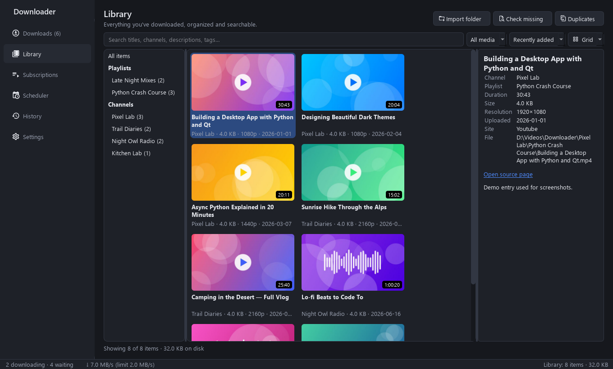
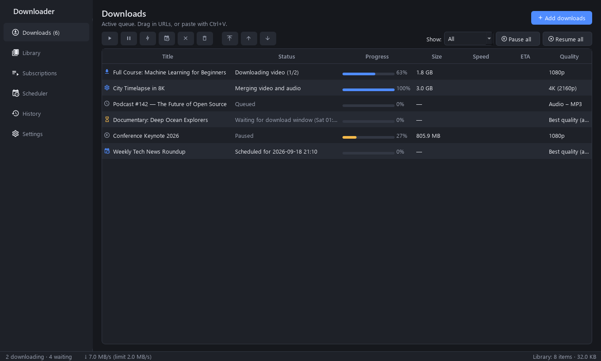
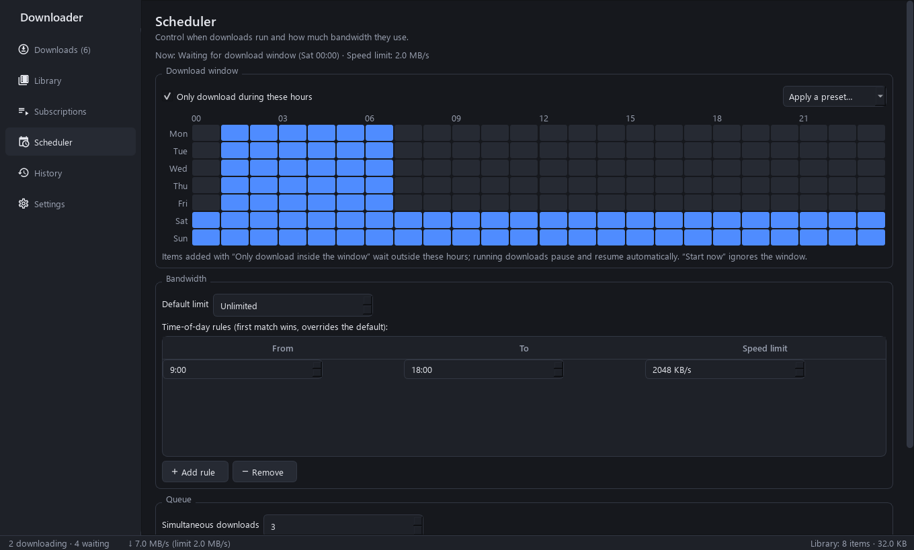
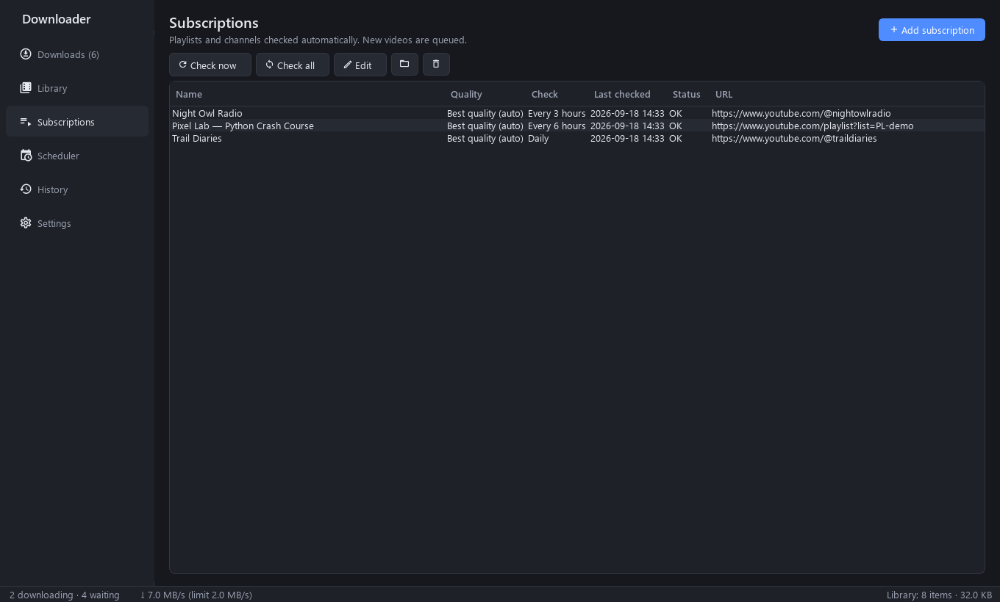
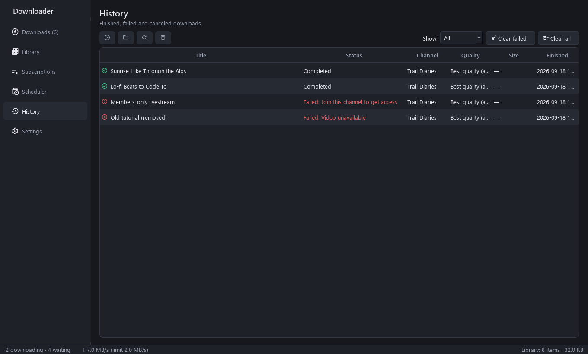
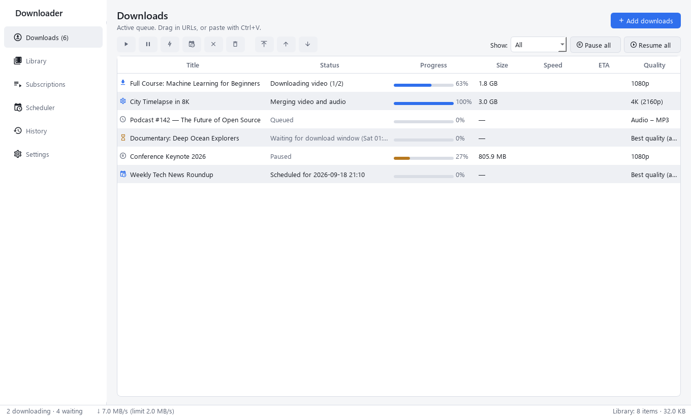
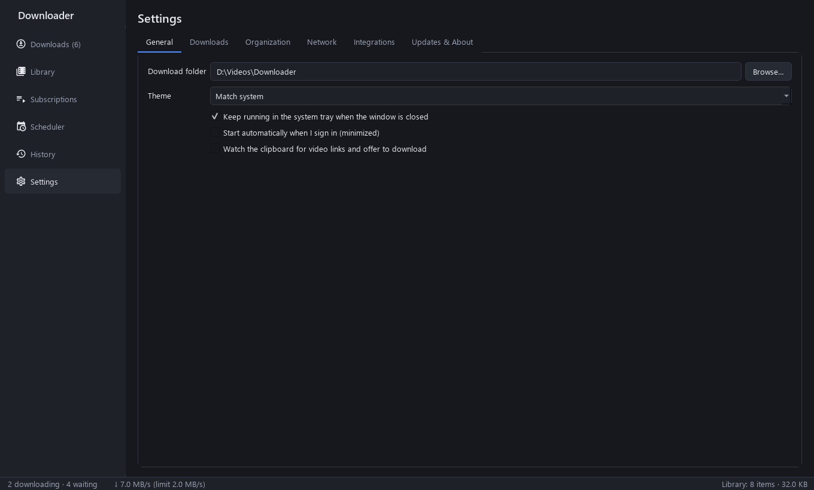

<div align="center">


# Downloader

**A desktop app for downloading, organizing and scheduling videos.**
Save videos and whole playlists from YouTube and 1,800+ other sites into a searchable library, with scheduled downloads and automatic playlist and channel checks.

[](https://github.com/ibrahimal22/downloader/releases/latest)
[](https://github.com/ibrahimal22/downloader/actions/workflows/ci.yml)
[](LICENSE)


### [⬇ Download for Windows](https://github.com/ibrahimal22/downloader/releases/latest)



</div>

---

## Why Downloader?

Most downloaders take a link and save a file. Downloader also manages what happens after
that and decides when downloads run:

- 🎬 **Download almost anything.** YouTube videos, playlists and channels, plus Vimeo, X,
  TikTok, Twitch, SoundCloud and [1,800+ more sites](https://github.com/yt-dlp/yt-dlp/blob/master/supportedsites.md).
- 📚 **Automatic organization.** Files go into tidy folders (`Channel/Playlist/001 - Title.mp4`)
  with thumbnails and metadata embedded, and show up in a searchable library.
- 🗓️ **Scheduling.** Download overnight, cap the speed during work hours, pause on battery,
  and put the PC to sleep when the queue is done.
- 🔔 **Subscriptions.** Follow a playlist or channel, and new videos are downloaded
  automatically.
- 🧩 **Works from your browser.** Right-click any link or video and choose *Download with
  Downloader*.

## Screenshots

| Downloads queue | Scheduler |
|---|---|
|  |  |
| **Subscriptions** | **History** |
|  |  |
| **Light theme** | **Settings** |
|  |  |

## Features

<details open>
<summary><b>Downloading</b></summary>

- Paste links, drag them in, press <kbd>Ctrl</kbd>+<kbd>V</kbd> anywhere, or import a `.txt` list
- The app fetches video info first, and you pick exactly which videos of a playlist to download
- Quality presets: Best, 4K, 1440p, 1080p, 720p, 480p, 360p, or a best-compatible MP4
- Audio only: MP3, M4A, Opus, FLAC
- Embeds the thumbnail, metadata and chapters. Subtitles in any language, including auto-generated ones
- SponsorBlock can mark or cut sponsor segments
- Cookies from your browser, for members-only, age-restricted or private videos you can already watch
- Proxy support
</details>

<details open>
<summary><b>Queue & scheduling</b></summary>

- Choose how many downloads run at once, overall and per website
- Priorities, reordering, pause, resume, cancel, and *Start now*
- Failed downloads retry automatically with growing delays; permanent errors such as a
  private video are recognized and not retried
- Picks up where it left off after closing the app or a crash
- **Download window**: a weekly grid of allowed hours, with presets such as *Nights* or
  *Nights + weekends*
- **Bandwidth schedule**: speed limits by time of day
- Pause on battery power or metered connections
- When the queue finishes: notify, sleep, or shut down, with a 60-second cancel
</details>

<details open>
<summary><b>Library & organization</b></summary>

- Customizable folder and file name templates with a live preview
- Grid or list view with thumbnails, full-text search over titles, channels, descriptions
  and tags, and filters by channel, playlist and media type
- Finds duplicates, detects moved or deleted files, and can import existing folders
- Optional `.nfo` files for **Kodi, Jellyfin and Plex**
- Download any item again at a different quality with one click
</details>

<details open>
<summary><b>Subscriptions</b></summary>

- Follow playlists and channels, checked every 30 minutes up to weekly
- Downloads only new videos. Choose to get the whole back-catalog, or *only new from now on*
- Filters for minimum or maximum length, title keywords, skipping Shorts, and upload date
- *Keep the latest N* automatically removes older videos
</details>

<details open>
<summary><b>Integrations</b></summary>

- A browser extension for Chrome, Edge and Firefox, with a context menu and toolbar button
- A clipboard watcher that offers to download copied video links
- Runs in the system tray with notifications. Optionally starts with Windows
- `downloader://` links: the browser extension uses these to launch the app when it isn't running
</details>

<details open>
<summary><b>Stays up to date</b></summary>

- yt-dlp updates itself daily (stable or nightly), so fixes arrive the day a site changes
- The app updates itself from GitHub Releases, checking each installer's SHA-256 before running it
</details>

## Installation

1. Download **`Downloader-x.y.z-Setup.exe`** from the
   [latest release](https://github.com/ibrahimal22/downloader/releases/latest).
2. Run it. No administrator rights are needed.
3. On first launch, Downloader fetches its components (yt-dlp, FFmpeg, Deno, about
   200 MB) from their official releases and checks each one's SHA-256.

> **Windows SmartScreen:** the installer isn't code-signed yet, so Windows may show
> *"Windows protected your PC"*. Click **More info → Run anyway**. You can compare the file
> with `SHA256SUMS.txt` on the release page.

### Browser extension

1. Download `Downloader-browser-extension.zip` from the release and unzip it.
2. **Chrome or Edge:** open `chrome://extensions` (or `edge://extensions`), turn on
   **Developer mode**, click **Load unpacked**, and pick the folder.
   **Firefox:** open `about:debugging` → *This Firefox* → **Load Temporary Add-on**.
3. In Downloader, open **Settings → Integrations**, copy the pairing token, and paste it
   into the extension's options.

## How it works

```
 Browser extension ─┐                         ┌─► yt-dlp  (+ FFmpeg, Deno)
 Clipboard / paste ─┼─► Download queue ───────┤
 Subscriptions ─────┘   scheduling · retries  └─► Library (SQLite + full-text search)
```

- **UI:** Qt 6 (PySide6), with light and dark themes
- **Engine:** each download runs [yt-dlp](https://github.com/yt-dlp/yt-dlp) as a separate
  process. The app reads its progress output directly and can stop the whole process tree
  cleanly.
- **Storage:** SQLite with schema migrations; the database is backed up before each migration
- **Browser bridge:** a server that only accepts connections from this computer, requires
  the pairing token, and only answers browser extensions

## Development

```powershell
git clone https://github.com/ibrahimal22/downloader
cd downloader
python -m venv .venv
.venv\Scripts\pip install -e ".[dev]"

.venv\Scripts\python -m downloader     # run the app
.venv\Scripts\pytest -q                # tests
.venv\Scripts\ruff check src tests     # lint
python build/build.py                  # build app + installer (needs Inno Setup 6)
```

<details>
<summary>Project layout</summary>

| Path | Purpose |
|---|---|
| `src/downloader/core/` | yt-dlp adapter, download queue, running processes, component manager |
| `src/downloader/scheduler/` | download window and bandwidth rules, recurring jobs, battery and network checks |
| `src/downloader/library/` | library index, search, imports, `.nfo` writer |
| `src/downloader/subscriptions/` | playlist and channel sync |
| `src/downloader/integrations/` | browser bridge, clipboard, tray, single instance, OS hooks |
| `src/downloader/ui/` | main window, pages, theme |
| `src/downloader/db/` | database models and migrations |
| `browser-extension/` | Manifest V3 extension |
| `build/`, `installer/` | PyInstaller spec, build script, Inno Setup script |
| `tools/screenshots.py` | regenerates the README screenshots |
</details>

**Releasing:** bump `__version__` in `src/downloader/__init__.py`, then push a tag such as
`v0.2.0`. The *Release* workflow tests, builds the installer, and publishes it together with
`SHA256SUMS.txt` and the browser extension. Installed copies pick up the update automatically.

## Contributing

Issues and pull requests are welcome. Please run `pytest` and `ruff check` before opening a PR.

## Legal

Downloader is a tool. Only download content you have the right to download, and respect
the terms of service of the sites you use and copyright law where you live.
DRM-protected content is not supported.

Licensed under the [MIT License](LICENSE). Third-party components are listed in
[THIRD_PARTY_NOTICES.md](THIRD_PARTY_NOTICES.md).
